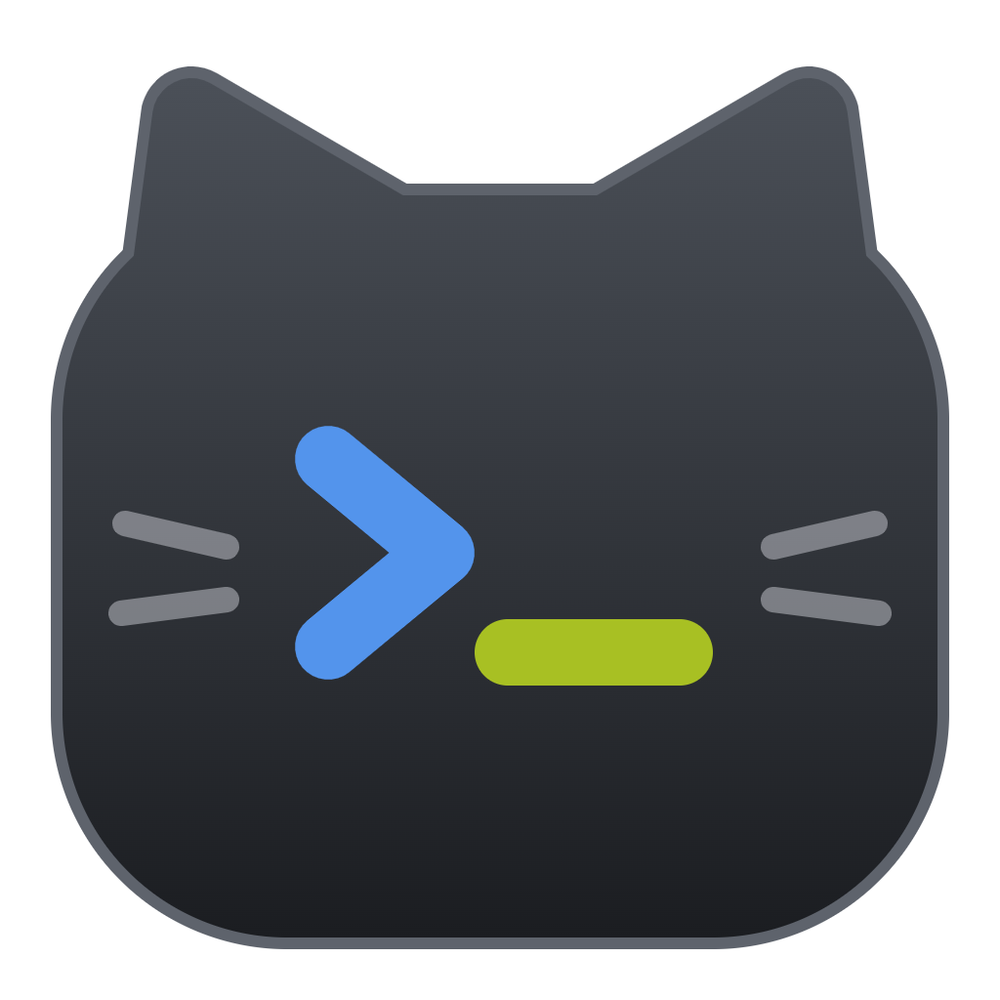
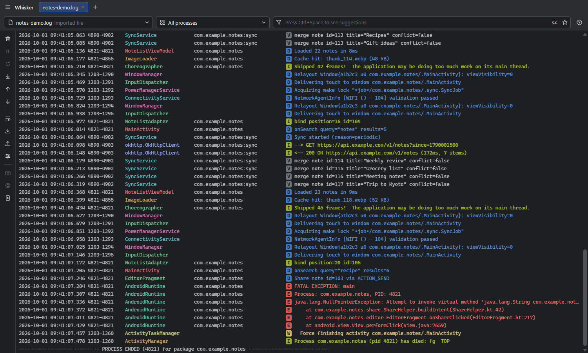
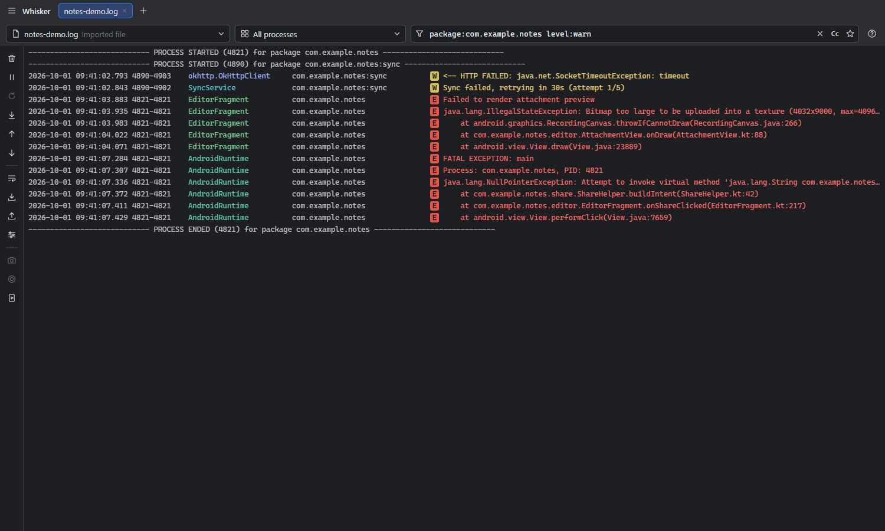
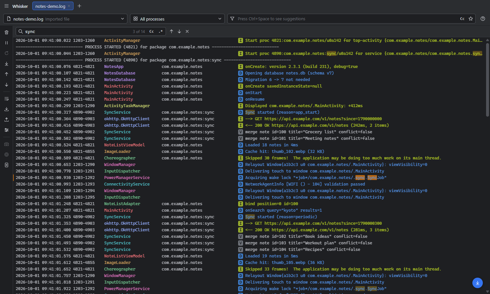

  

<h1 align="center">Whisker</h1>

  A desktop Android logcat viewer with screen mirroring. 
  It works like Android Studio's Logcat panel, so you can debug your app without opening Android Studio.

  <a href="https://github.com/cwchuca-dev/whisker/releases/latest">Download</a> ·
  <a href="#features">Features</a> ·
  <a href="#getting-started">Getting started</a> ·
  <a href="#troubleshooting">Troubleshooting</a>

## Why Whisker?

Android Studio's Logcat is great, but opening a full IDE just to read logs is slow, especially on a test bench, for QA, or when you work on the device rather than the code. Whisker gives you the same log view as a small standalone app:

- the same columns, colors and filter syntax as Android Studio;
- your app's logs followed by package name across restarts;
- the device screen mirrored next to the log;
- screenshots and screen recordings.

## Features

### Logcat, the way Android Studio shows it
- **Studio columns:** time, PID-TID, a colored tag, package, a level badge, and the message colored by level.
- **Process markers:** `PROCESS STARTED` and `PROCESS ENDED` lines, as Android Studio shows them.
- **Tabs:** each tab has its own device and filter. `Ctrl+T` adds one, a double-click renames it, and a middle-click closes it.
- **Reconnects:** Whisker notices when devices are plugged in or removed, and reconnects without repeating lines.
- **Performance:** each tab keeps the latest 200,000 lines and only draws the rows on screen, so it stays fast with chatty devices.
- **Colored logs:** terminal color codes that some SDKs write into messages (`[093m … [0m`) are removed.

### Filters

- **Package/process picker:**
  - It lists running apps with their PIDs, apps that have stopped, your installed apps, and system processes.
  - Select several to see their logs together.
  - It matches by name, so the view keeps following your app when it restarts with a new PID, and it waits for an app that hasn't started yet.
- **Android Studio's query syntax:**
  - `tag:`, `package:`, `process:`, `message:`, `line:`, `level:` and `age:5m`, plus `is:crash` and `is:stacktrace`.
  - `-tag:` excludes. `=:` matches exactly, and `~:` uses a regex.
  - `|`, `&`, parentheses and quoted values work too.
  - `package:mine` matches the third-party apps installed on the device.
  - Click **?** in the app for the full reference.
- **Suggestions** (`Ctrl+Space`) for keys, running packages, seen tags and levels.
- **Favorites and history** for filters you use often.
- **Hide noisy lines:** right-click a line to exclude its tag, its package, or every line with the same message. Lines that differ only in numbers count as the same message.

### Find

- `Ctrl+F` searches messages without hiding any lines. Matches are highlighted, and the bar shows a count such as *3 of 14*.
- `Enter` / `Shift+Enter` (or `F3` / `Shift+F3`) step through the matches, wrapping around at the ends.
- `Cc` matches case and `.*` searches with a regular expression.

### Device mirroring
- The phone button on the left toolbar opens the device screen next to the log, like Android Studio's *Running Devices*.
- It uses the bundled [scrcpy](https://github.com/Genymobile/scrcpy) server; you don't need to install scrcpy.
- **Mouse:** click or drag to tap or swipe. The wheel scrolls, right-click is Back, and middle-click is Home.
- **Keyboard:** click the screen, then type. IME input (for example Chinese) works, and `Ctrl+V` pastes your PC's clipboard on the device.
- **Buttons** for Power, Volume, Rotate, Notifications, Back, Home and Overview.
- The panel follows the active tab's device, and reconnects when the device comes back.

### Screenshots and screen recordings
- **Screenshot:** a preview opens where you can edit the image, then copy it to the clipboard or save it as PNG.
  - Rotate and crop.
  - Draw a pen, arrow, rectangle or text.
  - **Pixelate** areas to hide sensitive data.
- **Screen recording:** records the device screen to MP4 (video only, up to 30 minutes).
  - The preview lets you trim the clip frame-accurately, without re-encoding.
  - Copy the file to the clipboard (paste it into Slack, Teams or Explorer), or save it.
- **Auto-save:** turn it on in **Whisker menu → Capture**, and captures skip the preview and go straight to a folder (default `Pictures\Whisker`). This is handy for taking screenshots back to back.

### Everything else
- **Menu:** click the Whisker name or logo at the top left (or press `Alt`) for the File, Capture and View menus.
- **Import and export:** open a saved log file in a new tab (`Ctrl+O`), or export the filtered lines (`Ctrl+S`).
- **Selecting lines:** click, Shift-click and Ctrl-click to select lines, then `Ctrl+C` to copy.
- **Display:** soft-wrap, a compact view, and column toggles.
- **Settings:** remembered between launches; **Whisker menu → File → Reset All Settings…** restores the defaults.
- **Theme:** follows your Windows light or dark theme.

## Getting started

### Requirements
- **Windows 10 or 11** (64-bit).
- **adb**, from Google's [SDK Platform-Tools](https://developer.android.com/tools/releases/platform-tools). If you have Android Studio, you already have it.
  - If Whisker can't find adb, it says so and offers a download link and a **Locate adb.exe…** button.
  - It looks for adb in this order:
    1. the `adb.exe` you chose with **Locate adb.exe…**;
    2. the `ADB` environment variable (the full path to `adb.exe`);
    3. `ANDROID_HOME` or `ANDROID_SDK_ROOT`;
    4. the default SDK folder, `%LOCALAPPDATA%\Android\Sdk`;
    5. your `PATH`.
  - It checks again every few seconds, so installing Android Studio or choosing adb works without a restart. Changes to environment variables need a restart.
- **An Android device with USB debugging on.** Turn on *Developer options* (tap *Build number* seven times), then *USB debugging*. Mirroring and recording need Android 5.0 or later.

### Install
Download the latest version from the [Releases page](https://github.com/cwchuca-dev/whisker/releases/latest):

| File | Use it if… |
| --- | --- |
| `Whisker Setup x.y.z.exe` | You want Whisker installed, with a Start menu entry. No admin rights are needed. **Recommended.** |
| `Whisker x.y.z.exe` | You want a portable app that runs without installing. |

> **"Windows protected your PC"?** Whisker isn't code-signed yet, so SmartScreen may warn you the first time. Click **More info → Run anyway**.

### First run
1. Connect your device with a USB cable, and accept the **Allow USB debugging?** prompt on the device.
2. Start Whisker. The device is picked automatically, and logs start streaming.
3. Pick your app in the **package/process** dropdown, or type a filter such as `package:com.example.app level:warn`.

## Keyboard shortcuts

| Key | Action |
| --- | --- |
| `Ctrl+F` | Find in messages |
| `Enter` / `Shift+Enter`, `F3` / `Shift+F3` | Next / previous match |
| `Ctrl+L` | Focus the filter |
| `Ctrl+Space` | Filter suggestions |
| `Ctrl+T` | New tab |
| `Ctrl+O` / `Ctrl+S` | Import / export a log |
| `Space` | Pause / resume |
| `End` / `Home` | Jump to the newest / oldest line |
| `Ctrl+A`, `Ctrl+C` | Select all shown lines, copy the selection |
| `Alt` | Open the menu |
| `Esc` | Clear the selection, or close a popup or the find bar |

## Troubleshooting

<b>No devices are listed</b>

- Check that `adb devices` lists the device in a terminal.
- If it shows **unauthorized**, unlock the device and accept the USB debugging prompt.
- If Whisker shows **adb not found**, install [Platform-Tools](https://developer.android.com/tools/releases/platform-tools), or click **Locate adb.exe…** and pick it in the `platform-tools` folder.
- Try another cable or USB port. Some cables only charge.

<b>Mirroring or recording doesn't start</b>

- The device must be unlocked the first time, and running Android 5.0 or later.
- Some devices (for example, some Xiaomi models) also need *USB debugging (Security settings)* turned on for input to work.
- Click **Restart** on the mirror panel. The error message comes straight from scrcpy and usually says what's wrong.

<b>My app's logs are missing</b>

- Check the package/process dropdown and the filter. The **×** on each clears it.
- Some devices limit the log buffer. Try **Formatting options → Log Buffer → all**.

## Privacy

Whisker runs entirely on your computer. It talks only to adb and your device, and it doesn't collect or send any data. Settings are stored in `%APPDATA%\Whisker`.

## Contributing

Bug reports, ideas and pull requests are welcome. See [CONTRIBUTING.md](CONTRIBUTING.md) for building from source and how the code is organized.

## Acknowledgements

- Mirroring and recording use the [scrcpy](https://github.com/Genymobile/scrcpy) server by Genymobile, bundled under the Apache License 2.0 ([`vendor/scrcpy`](vendor/scrcpy)).
- The log view is modeled on the Logcat panel of [Android Studio](https://developer.android.com/studio).

Whisker isn't affiliated with or endorsed by Google. Android is a trademark of Google LLC.

## License

[MIT](LICENSE) © 2026 Wing Chu
